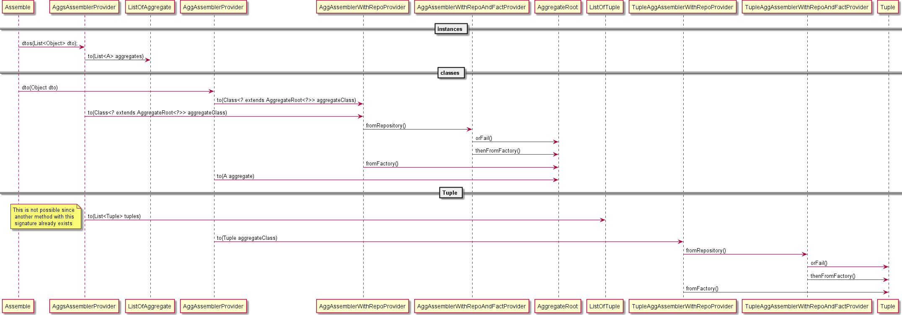
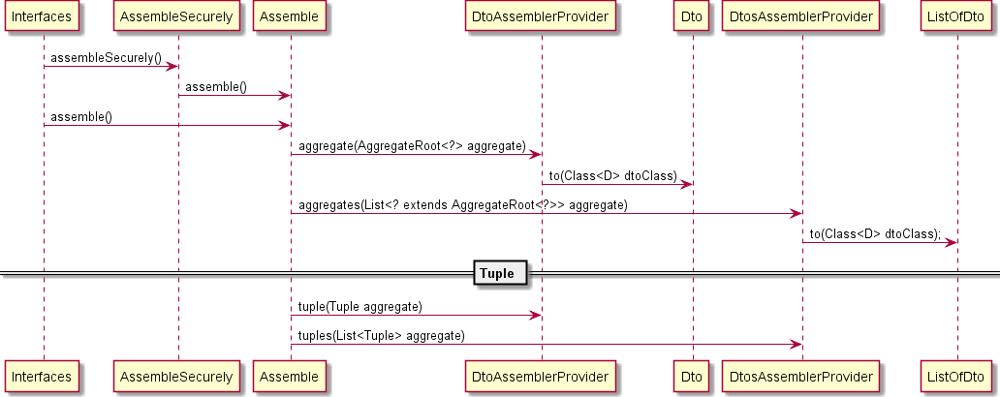

- PEP: 004
- Title: Assembler enhancements
- Authors: 
 - Adrien LAUER <adrien.lauer@mpsa.com>
 - Kavi RAMYEAD <kavi.ramyead@ext.mpsa.com>
 - Pierre THIROUIN <pierre.thirouin@ext.mpsa.com>
 - Redouane LOULOU <redouane.loulou@ext.mpsa.com>
- Status: accepted

# Abstract

The idea is to provide two main assembler enhancements to ease the writing of interfaces (like REST APIs):
- Automatic assemblers, so users won't have to write them explicitly.
- An assembler DSL to replace the various methods of Assemblers.

# Motivation

Assemblers often represent a significant part of code that needs to be written in the interface layer. Most of this code can be automated. This will lead to a reduction of the coding effort, particularly when writing REST APIs.

# Specification

In order to do this, we will create a specific assembler extending `AbstractBaseAssembler`. It will use the DSL provided by [ModelMapper](http://modelmapper.org/).

## Automatic assembler

```java
public class AutomaticAssembler<AGGREGATE_ROOT extends AggregateRoot<?>, DTO extends Object> extends AbstractBaseAssembler<AGGREGATE_ROOT, DTO>{
...
}
```

`AutomaticAssembler` will keep the compatibility with the current
assemblers by specializing them for automatic mapping. The do...()
methods will already be implemented in those automatic assemblers with
the ability for end users to override a configure() method if special
configuration is needed. An explicitly written assembler class will
not be needed if the developer want to keep the default behavior (much
like the default factories or repositories). In that case, an
annotation must be applied on the DTO class for the framework to
recognize the association to the aggregate. **This part will
supplement the currently existing assemblers.**

```java
public MyAssembler extends AutomaticAssembler<MyAggregateRoot, MyDTO> {

    public void configureAssembly(MyAggregateRoot source) {
        map().getAddress().setStreet(source.getStreet());
        skip(source.name);
    }

    public void configureMerge(MyDTO source) {
        map().getAddress().setStreet(source.getStreet());
    }

}
```

Note that map(), skip() and other methods should detect from which
method it is called to provide the right target.

## Assembler DSL

On top of that a DSL will be provided to developers to specify
the whole assembling behavior, including loading from a
repo, creating from a factory and so on...

> This part will completely replace the current Assemblers facade, 
> which should be deprecated.

**Dto to aggregate**



```java
import static org.seedstack.business.api.interfaces.Interfaces.assemble;
...

/* Setup */
OrderDto orderDto = new OrderDto();
Order myOrder = new Order();
Customer customer = new Customer();
List<Object> dtos = Lists.newArrayList(orderDto, myOrder);
List<Order> orders = Lists.newArrayList(myOrder, myOrder);

/* Usage */
Order order1 = merge(orderDto).into(myOrder);

// from factory
Order order2 = merge(orderDto).into(Order.class).fromFactory();

// list of dto to tuple of aggregates
Pair<Order, Customer> order3 = merge(dtos).into(Order.class, Customer.class).fromFactory(); 

// list of dtos to list of aggregates
List<Order> orders2 = merge(dtos).to(orders);

// from repo or fact
Order order4 = merge(orderDto).into(Order.class).fromRepository().orFromFactory();

// from repo or fail
Order order5;
try {
    order5 = merge(orderDto).into(Order.class).fromRepository().orFail();
} catch (AggregateNotFoundException e) {
    e.printStackTrace();
}
```

**With qualifier**

```java
order = merge(orderDto).to(Order.class).with(ModelMapper.class)
    .fromRepositories(Names.named("jpa")).thenFromFactories(Names.named("fact1"));
```

**Aggregate to dto**



```java
OrderDto orderDto1 = assemble(myOrder).to(OrderDto.class);
```

with tuple:

```java
orderDto1 = assemble(aCustomer, anOrder).to(OrderDto.class);
```

## Matching DTO parameters to factory's methods

In order to implement the methods `fromRepository()` and
`fromFactory()` we need:
1. load an aggregate from a repository based its id 
2. Create an aggregate with a factory based on the dto

For the first case, we need to find/construct the aggregate id from the dto.
For the second case, we need to map dto getter methods to the factory
method parameters.

What we have now.

```java
public class ProductDto {
    private Short storeId;
    private Short productCode;
    private String name;
    private Integer price;

    @MatchingFactoryParameter(index=0)
    public String getName() {
        return name;
    }

    @MatchingAggregateId (index=0)
    @MatchingFactoryParameter(index=1)
    public Short getStoreId() {
        return storeId;
    }

    @MatchingAggregateId (index=1)
    @MatchingFactoryParameter(index=2)
    public Short getProductCode() {
        return productCode;
    }
}
```

```java
@Embeddable
public class ProductId extends BaseValueObject {
    private Short storeId;
    private Short productCode;

    ProductId() {
    }

    public ProductId(Short storeId, Short productCode) {
        this.storeId = storeId;
        this.productCode = productCode;
    }
}
```

```java
public interface ProductFactory extends GenericFactory<Product> {
    Product createProduct (String name, Short storeId, Short productCode);
}
```

We may reduce the annotation `@MatchingAggregateId` to `@MatchId` and
`@MatchingFactoryParameter` to `@MatchParam` in order to improve the
lisibility.

This algorithm will be extract into the following interface. It will
convert the information on the dto into a object representing the
method parameters. This object will then be used to call the factory
method or the object constructor. The matching will be done via the
`MethodMatcher` utility class.

```java
public interface DtoInfoResolver {

    ParameterHolder resolveId(Object dto);

    ParameterHolder resolveAggregate(Object dto);

}
```
