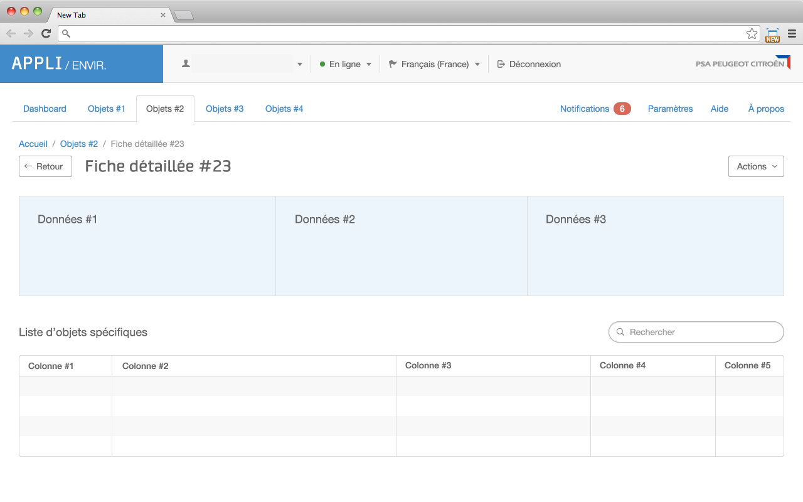
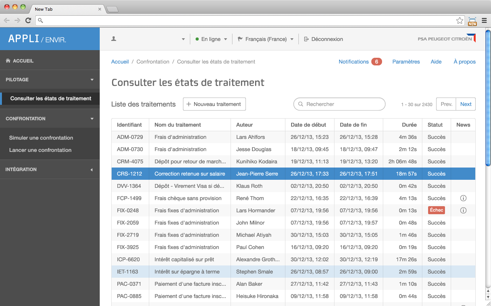
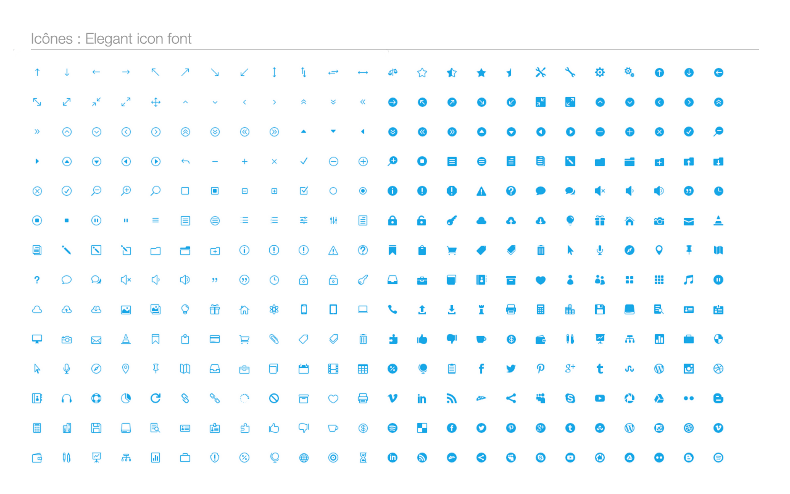
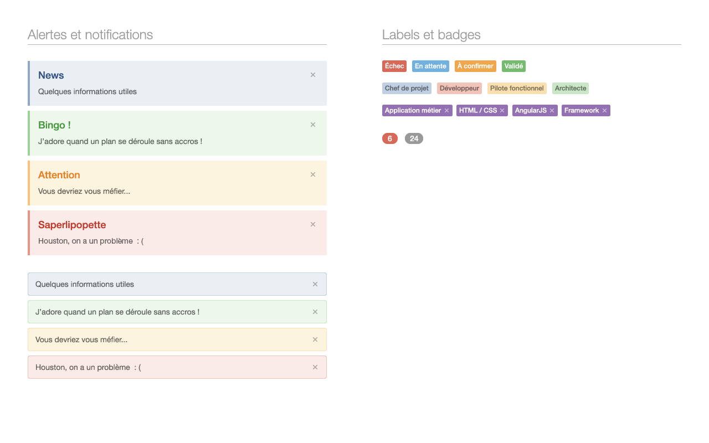
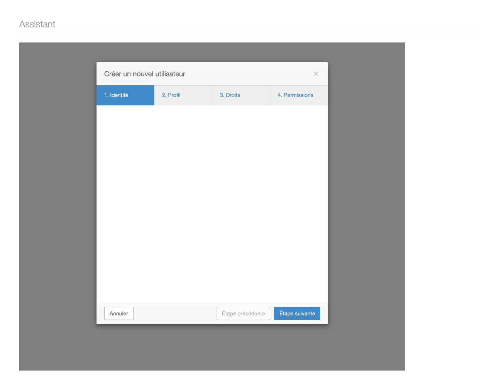

PEP: 001  
Title: W20 business clean theme  
Author: Adrien LAUER <adrien.lauer@mpsa.com>  
Status: draft  

# Abstract

Create a reference graphical theme for the W20 framework that can be used to design business-oriented
Web applications. This theme must:

* Provide a visual "container" for the application with a topbar and a side menu.
* Provide simple styling for all UI components,
* Define colors, typography and iconography,
* Be clean and pretty,
* Be based on the components found solely in W20 UI.

# Motivation

Currently, we only have the simple theme, which is little more than plain Bootstrap 3 with a minimal navigation
menu. This theme will provide a much more complete solution for building enterprise web applications.

# Specification

## Container

### Without menu

### With menu

### Homepage

### Typical pages

### Tabbed page

### With grid

## Style

### Colors

### Fonts

### Icons

## Notable components

### Alerts, labels and badges

### Buttons, fields and lists

### Modals

### Dialogs

### Wizard

### Data tree

### Data grid

